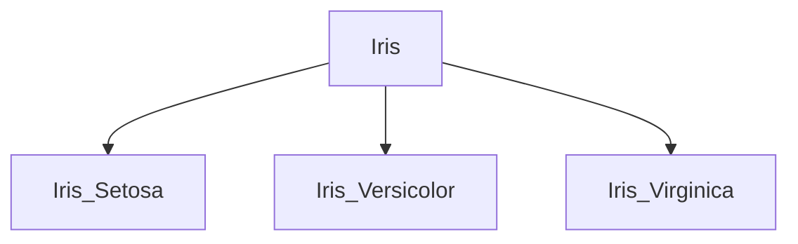

# Iris_Dataset
Iris dataset is one of the classic dataset we use for studying data science

**we use it because of two reasons**

1.It is small in size so for understanding point of view it is easy to grasp

2.it has lot of different attributes that gives us lots of option to study 

We will be loading iris dataset using scikit-learn built in dataset

we could have also loaded this dataset using 

**sns.load_dataset('iris')**

Iris dataset is a  multi class classification. We have total of three class as seen in the figure. each class has its own 50 samples.which makes a total of 150 sample that we will work upon

